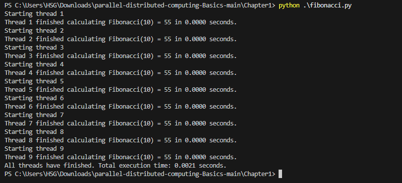

# Chapter 1

## fibonacci

### Explaination:
This Python script demonstrates parallel computation of Fibonacci numbers using multiple threads. The `calc_fibonacci(n)` function calculates the Fibonacci number for a given `n` recursively, where the base cases are when `n` equals 0 or 1. The `timed_fibonacci(n, thread_num)` function wraps the Fibonacci calculation to measure and print the time taken for each thread to compute the result. In the main part of the script, a list of threads is created, and nine threads are started to calculate the Fibonacci of 10 concurrently. After launching all threads, the program waits for their completion using `t.join()`. The execution time for each thread is printed, and at the end, the total time for all threads to finish is shown. This approach demonstrates how threading can be used for parallel computation to improve performance when dealing with independent tasks like Fibonacci calculations.
### Output:

