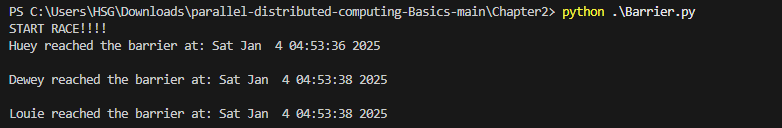

# Chapter 2

## Barrier

### Explaination:
This script simulates a race between three runners using Python’s `threading` module and a `Barrier` for synchronization. The race begins when three threads are created, each representing a runner. The runners, identified as "Huey," "Dewey," and "Louie," each take a random amount of time (between 2 to 5 seconds) to reach the barrier, simulated by `sleep(randrange(2, 5))`. Once a runner reaches the barrier, they print a message with their name and the time they reached it using `ctime()`. Each runner then waits at the barrier using `finish_line.wait()` until all other runners have arrived. The `Barrier` ensures that all runners proceed together, meaning the race only continues once all runners have reached the barrier. After all runners reach the barrier, the program prints "Race over!" and the race concludes. This example illustrates concurrency and synchronization in multi-threaded applications, where threads are allowed to run independently but must synchronize at certain points.

### Output:

