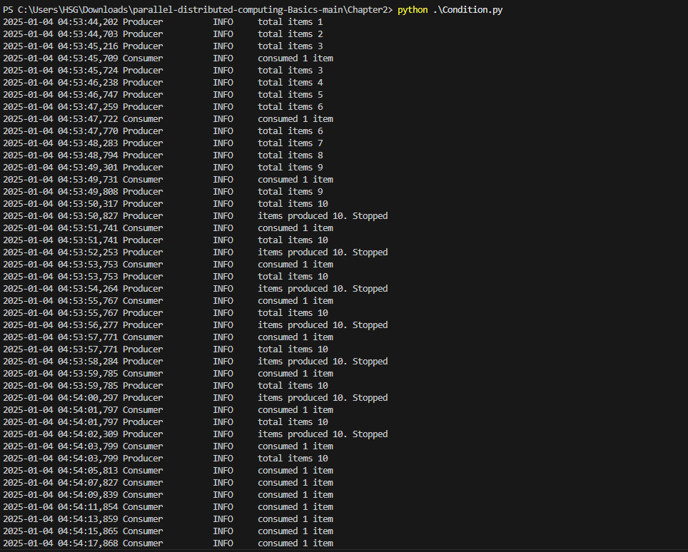
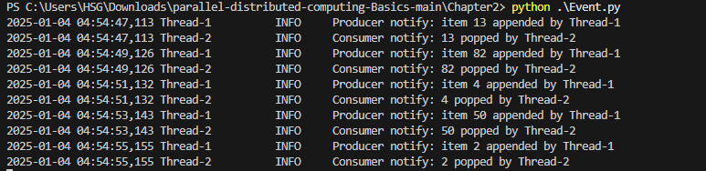
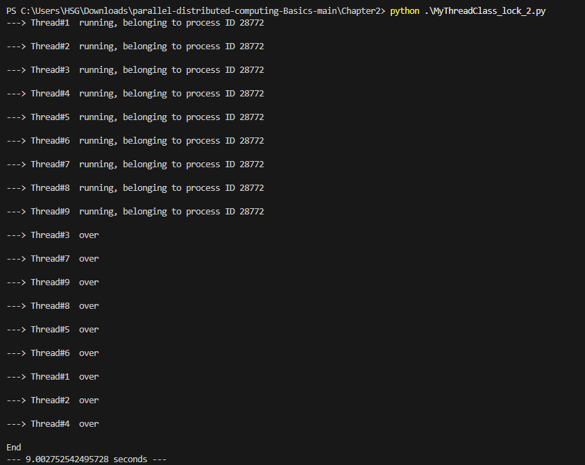
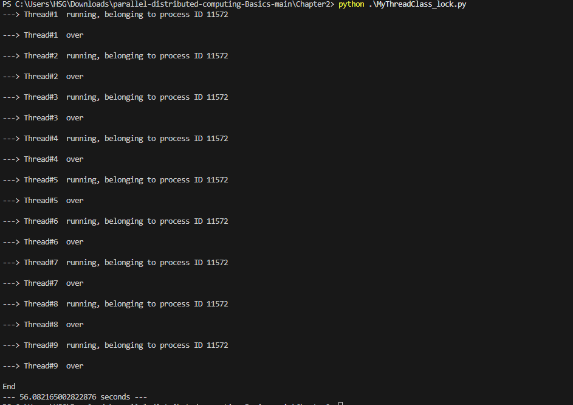
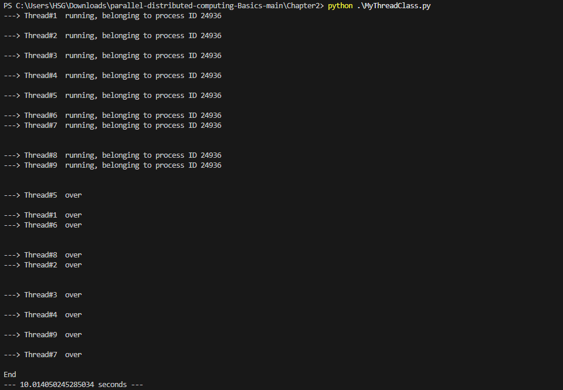
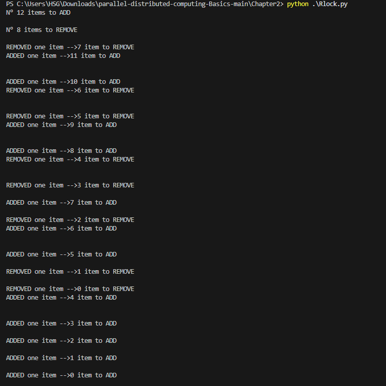
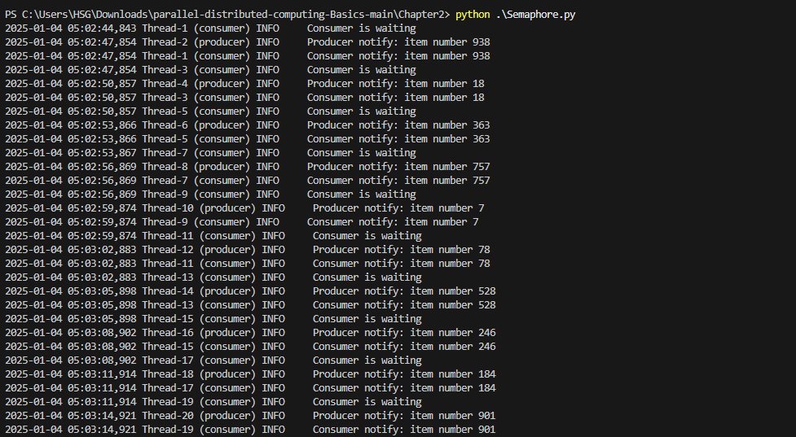

# Chapter 2

## Barrier

### Explaination:
This script simulates a race between three runners using Python’s `threading` module and a `Barrier` for synchronization. The race begins when three threads are created, each representing a runner. The runners, identified as "Huey," "Dewey," and "Louie," each take a random amount of time (between 2 to 5 seconds) to reach the barrier, simulated by `sleep(randrange(2, 5))`. Once a runner reaches the barrier, they print a message with their name and the time they reached it using `ctime()`. Each runner then waits at the barrier using `finish_line.wait()` until all other runners have arrived. The `Barrier` ensures that all runners proceed together, meaning the race only continues once all runners have reached the barrier. After all runners reach the barrier, the program prints "Race over!" and the race concludes. This example illustrates concurrency and synchronization in multi-threaded applications, where threads are allowed to run independently but must synchronize at certain points.

### Output:

## Condition

### Explaination:
This script demonstrates the producer-consumer problem using Python's `threading` module. It simulates a scenario where a producer thread generates items, and a consumer thread consumes them, with synchronization managed by a `Condition`. The producer and consumer are run as separate threads.

The `Producer` thread produces an item and appends it to the shared `items` list. If the list reaches a capacity of 10 items, the producer waits for the consumer to consume an item before producing more. On the other hand, the `Consumer` thread waits for items to be available in the `items` list. If there are no items to consume, it waits for the producer to add some. Once the consumer consumes an item, it notifies the producer that there is space for more items. 

The logging module is used to track and log the process, with logs detailing when items are produced, consumed, or when the threads wait due to reaching certain conditions. Each thread sleeps for a specific time to simulate real-world delays between producing and consuming items. The program runs until both the producer and consumer threads have completed their tasks. 

This approach ensures that the producer and consumer do not interfere with each other while accessing shared resources, demonstrating safe and efficient thread synchronization.

### Output:

## Event

### Explaination:
This script models a producer-consumer scenario using Python’s `threading` module, where the `Producer` thread generates random items and appends them to a shared list, `items`. The `Consumer` thread, on the other hand, waits for an item to be available in the list before consuming it. The producer and consumer threads are synchronized using a `threading.Event`. Each time the producer generates an item, it appends it to the list and triggers the event, notifying the consumer that an item is available. The consumer waits for the event to be set, then pops an item from the list and processes it. The producer produces five items in total, and after each item is produced, the event is cleared, ensuring the consumer can only act when the producer signals it. The script makes use of the `logging` module for detailed output, showing when items are added or removed, and which thread is performing the action. This process continues until the producer finishes its work, allowing the consumer to process all available items.

### Output:

## MyThreadClass_lock_2

### Explaination:
This Python script demonstrates the use of multithreading, where multiple threads are created and managed to simulate concurrent execution. The program defines a custom thread class, `MyThreadClass`, which accepts a `name` and `duration` to simulate some work by sleeping for a random amount of time between 1 and 10 seconds. Each thread acquires a lock before printing the process information, which ensures that only one thread can access the critical section of code (where it prints to the console) at a time. After performing the work (sleeping), the thread releases the lock and prints a message indicating its completion.

The `main()` function creates 9 threads, each with a unique name and a random sleep duration. These threads are started and then joined, meaning the main program waits for each thread to finish before continuing. The execution time is calculated by noting the start and end times, and the total time taken for all threads to complete is displayed. The program demonstrates the use of thread synchronization with locks, ensuring orderly access to shared resources while allowing multiple threads to execute concurrently.

### Output:

## MyThreadClass_lock

### Explaination:
This Python script demonstrates the use of multithreading with a lock mechanism to ensure that threads run in a synchronized manner. The program defines a custom thread class, `MyThreadClass`, which accepts a name and a duration. Each thread simulates some work by sleeping for a random duration, and during this time, the thread acquires a lock to print the process ID and the status of the thread. This lock ensures that only one thread can print at a time, preventing race conditions and ensuring orderly output.

In the `main()` function, 9 threads are created, each with a random sleep duration between 1 and 10 seconds. These threads are started and then joined, meaning the program waits for all threads to finish before continuing. The execution time is recorded from the start to the end of the process, and after all threads have completed their work, the total time taken is printed. This approach allows for concurrent execution while managing access to shared resources using threading locks, ensuring smooth execution even when multiple threads are involved.

### Output:

## MyThreadClass

### Explaination:
This Python script demonstrates the creation and management of multiple threads using the `threading` module. Each thread, represented by the custom `MyThreadClass`, is initialized with a name and a randomly generated duration for which it will "sleep" (simulate a task). The `run()` method of the thread is responsible for printing the name of the thread, the process ID, sleeping for the specified duration, and then printing a message indicating that the thread has completed its task.

The `main()` function creates nine threads, each with a different random duration between 1 and 10 seconds. The threads are started concurrently using the `start()` method. After starting each thread, the `join()` method is called on each thread to ensure the main program waits for all threads to complete before proceeding. The execution time of the entire process is measured, and once all threads have finished, the total time taken is printed.

This approach allows the threads to run concurrently, simulating a multithreading environment where multiple tasks are performed simultaneously, and synchronization between them is automatically managed by the Python threading library.

### Output:

## Rlock

### Explaination:
This Python script demonstrates how to manage concurrent access to shared resources using threads and a reentrant lock (`RLock`). The program defines a `Box` class that contains a `total_items` attribute, which is modified by two threads: one for adding items and another for removing them. The `Box` class uses an `RLock` to ensure that these modifications are thread-safe, allowing only one thread to modify the `total_items` attribute at a time. The `adder` and `remover` functions simulate the addition and removal of items, respectively, with a sleep interval of 1 second to mimic real-world delays. In the `main` function, two threads are created—one to add items and another to remove them, both with randomly chosen numbers of items. The `join()` method ensures that the main program waits for both threads to finish before terminating. This script effectively demonstrates the use of threading and locks in Python to manage shared resources safely.

### Output:

## Semaphore

### Explaination:
This Python script demonstrates the use of a semaphore for synchronizing two threads: a producer and a consumer. The producer thread generates a random item number, which is then consumed by the consumer thread. The semaphore is initialized with a value of 0, meaning the consumer will initially be blocked until the producer releases the semaphore. The producer thread simulates a delay of 3 seconds before generating a random item, logging the item number, and releasing the semaphore to allow the consumer to proceed. The consumer waits for the semaphore to be released before logging the item number it consumes. The `main()` function creates and starts 10 pairs of producer and consumer threads, ensuring that the producer and consumer run concurrently. The `join()` method ensures that the main thread waits for both threads to complete before proceeding to the next iteration. This example shows how to use semaphores for controlling access to shared resources between threads in a synchronized manner.

### Output:

